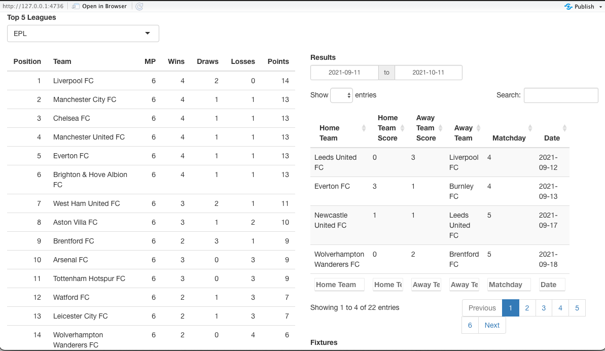
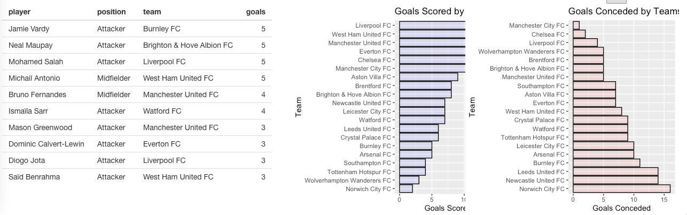

```{r, echo=FALSE}
knitr::opts_chunk$set(error = TRUE)
```

---
title: "Football Statistics API with R, Lab05"
author: "Farid Musayev, Mucahit Sahin, Selen Karaduman"
date: "`r Sys.Date()`"
output: rmarkdown::html_vignette
vignette: >
  %\VignetteIndexEntry{Vignette Title}
  %\VignetteEngine{knitr::rmarkdown}
  %\VignetteEncoding{UTF-8}
---

### Football Statistics API with R, Lab05
**Introductıon**

This R package is designed to get data from an web API. The following web API server is used to acquire the data. **https://www.football-data.org/** . The API server able to provide many different type of football data but this R package will be focused on **Fixtures** , **Results** , **Scorers** , **Standings** .

The web API server operates single URL by modifying the section for specific information. See the example below. For exmaple, for EPL,the url modified as 2021, for Bundesliga 2002, for LaLiga 2014 etc.

```{r}

  leagues=list(EPL = 2021, BundesLiga = 2002,
               LaLiga = 2014, Ligue1 = 2015, SerieA = 2019)

myurl<- "https://api.football-data.org/v2/competitions/%s/matches?status=FINISHED"

sprintf(myurl,leagues[["EPL"]])

```


##### Required packages

***httr***   

***jsonlite***  

***pandoc***

***rmarkdown***

***tibble***

***DT*** 

***ggplot2***

***shinny***

***tidyverse*** 

***gridExtra*** 


## Fixtures

This is an application of ***get_fixtures("EPL")***

```{r, echo=FALSE}
library(httr)
library(tibble)
library(jsonlite)
library(rmarkdown)
get_fixtures<-function(league_name){

  leagues=list(EPL = 2021, BundesLiga = 2002,
               LaLiga =  2014, Ligue1 = 2015, SerieA = 2019)

  my_url<-sprintf("https://api.football-data.org/v2/competitions/%s/matches?status=SCHEDULED",
                  leagues[[league_name]])

  comp2 <- GET(url=my_url,
               add_headers("X-Auth-Token"="ad55814c6db4453d8d7c63b828eb08a2")
  )

  df<-fromJSON(rawToChar(comp2$content))

  ndf<-df$matches


  ref<-cbind(ndf$homeTeam$name,ndf$awayTeam$name,ndf$matchday,ndf$utcDate)

  colnames(ref)<-c("Home Team","Away Team",
                   "Matchday","Date")

  ref<-as_tibble(ref)


  ref$Matchday<-as.numeric(ref$Matchday)

  ref$Date<-as.Date(ref$Date)

  ref<-as.data.frame(ref)

  return(ref)

}


head(get_fixtures("EPL"),5)

```

## Results

This is an application of ***get_results("EPL")***


```{r, echo=FALSE}

get_results<-function(league_name){

  leagues=list(EPL = 2021, BundesLiga = 2002,
               LaLiga = 2014, Ligue1 = 2015, SerieA = 2019)

  my_url<-sprintf("https://api.football-data.org/v2/competitions/%s/matches?status=FINISHED",
                  leagues[[league_name]])

  comp2 <- GET(url=my_url,
               add_headers("X-Auth-Token"="ad55814c6db4453d8d7c63b828eb08a2")
  )

  df<-fromJSON(rawToChar(comp2$content))

  ndf<-df$matches


  ref<-cbind(ndf$homeTeam$name, ndf$score$fullTime$homeTeam, ndf$score$fullTime$awayTeam,
             ndf$awayTeam$name,ndf$matchday,ndf$utcDate)

  colnames(ref)<-c("Home Team","Home Team Score","Away Team Score","Away Team",
                   "Matchday","Date")

  ref<-as_tibble(ref)


  ref$Matchday<-as.numeric(ref$Matchday)

  ref$Date<-as.Date(ref$Date)

  ref<-as.data.frame(ref)

  return(ref)

}

print(as_tibble(head(get_results("EPL"),5)))

```

## Scorers

This is an application of ***get_scorers("EPL")***

```{r,echo=FALSE}

get_scorers<-function(league_name){

  leagues=list(EPL = 2021, BundesLiga = 2002,
               LaLiga = 2014, Ligue1 = 2015, SerieA = 2019)

  my_url<-sprintf("https://api.football-data.org/v2/competitions/%s/scorers",
                  leagues[[league_name]])

  comp2 <- GET(url=my_url,
               add_headers("X-Auth-Token"="ad55814c6db4453d8d7c63b828eb08a2")
  )

  df<-fromJSON(rawToChar(comp2$content))

  t2<-df$scorers

  new_t<-data.frame(player=t2[,'player']$name,position=t2[,'player']$position,
                    team=t2[,'team']$name, goals=t2[,'numberOfGoals'])

  return(new_t)
  


}

get_scorers("EPL")

```


## Standings

This is an application of ***get_standings("EPL")***


```{r, echo=FALSE}

get_standings<-function(league_name='EPL'){

  leagues=list(EPL = 2021, BundesLiga = 2002,
               LaLiga = 2014, Ligue1 = 2015, SerieA = 2019)

  my_url<-sprintf("https://api.football-data.org/v2/competitions/%s/standings",
                  leagues[[league_name]])

  comp2 <- GET(url=my_url,
               add_headers("X-Auth-Token"="ad55814c6db4453d8d7c63b828eb08a2")
  )

  df<-fromJSON(rawToChar(comp2$content))

  standings<-df$standings[[4]][[1]]

  standings[,2]<-standings[,2]$name

  standings<-standings[,-4]

  colnames(standings)<-c("Position", "Team", "MP",
                         "Wins","Draws", "Losses","Points", "GF",
                         "GA", "GD")

  col_order<-c("Position","Team", "MP",
               "Wins","Draws", "Losses", "GF",
               "GA", "GD", "Points")

  standings<-standings[,col_order]

  return(standings)

}

get_standings("EPL")

```

## Shinny Application

The application can be called with ***shiny_lab()***. Enjoy :)






